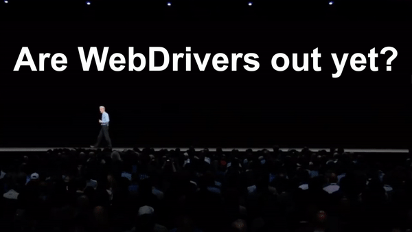

# Anti-Hackintosh-Buyers-Guide

This is an information thread, for discussion please see the Reddit version of this post here: [Anti-Hackintosh Buyers Guide](https://www.reddit.com/r/hackintosh/comments/c0y312/antihackintosh_buyers_guide/)

**Hyperlinks:**
* [CPU](README.md#CPU)
* [GPU](README.md#GPU)
* [Motherboard](README.md#Motherboard)
* [Storage](README.md#Storage)
* [RAM](README.md#RAM)
* [Cooler](README.md#Cooler)
* [Networking](README.md#Networking)
* [Wireless](README.md#Wireless)
* [Power Supply](README.md#Power-Supply)
* [Case](README.md#Case)
* [Thermal Paste](README.md#Thermal-Paste)

# An introduction

So what is the Anti-Hackintosh Buyers Guide and why should you care about this post? Well, this is a guide of what not to buy when building a Hackintosh and will be kept up-to-date as new hardware comes out. While this guide won't give exact recommendations, it'll try and point you in the right direction.

# CPUs

**CPUs to avoid:**

While AMD CPUs can work but we advise against them due to numerous issues still plaguing them as they're not natively supported. They require quite a bit more work to get setup but for those who like would prefer AMD there is the [AMD Vanilla Guide](https://vanilla.amd-osx.com)

* AMD Ryzen 1000 Series
* AMD Ryzen 2000 Series
* AMD Ryzen 3000 Series
* AMD FX Series

With Intel, the thanks to most of the CPUs being quite similar they have support when the CPU is spoofed to a supported model. The only downside is that the iGPU rarely work on these models meaning a cheap iGPU Hackintosh is impossible with these CPUs. Regarding X99/LGA 2011-V3 CPUs, there's the issue that these CPUs were never shipped in a real Mac so quite a few issues are present when running macOS on these systems. Avoid if possible

* Intel Atoms
* Intel Celerons
* Intel Pentiums
* Intel X99/LGA 2011-V3

# GPUs

~~Get an RTX GPU, I want to see people suffer as they slowly realize that they don't even have support in HighSierra. Let the Nvidia fans die a slow and painful death, let this be a reminder to never cross our lord and saviour Tim Apple~~
If you don't want a headache, stay away from all Nvidia GPUs that aren't Kepler based. Currently(and likely forever), Turing and Volta GPUs have no support whatsoever in any version of macOS while Pascal and Maxwell have their support stopping in High Sierra while also requiring WebDrivers so they're not native GPUs.

>  B-b-but are the drivers out yet?

With AMD, Navi GPUs drivers are currently not included in either macOS Mojave 10.14.6 nor macOS Catalina 10.15 Developer Beta 1 so please hold off until these GPUs have drivers included in macOS. And Lexa based AMD GPUs like the RX 550 have never had support

For GPUs we recommend, check out the [Mojave GPU Buyers Guide](https://www.reddit.com/r/hackintosh/comments/b91vf5/mojave_gpu_buyers_guide/) and the soon to come [Catalina GPU Buyers Guide](https://github.com/khronokernel/Catalina-GPU-Buyers-Guide)
And for those who are running unsupported GPUs, there's still hope for you! With my patent pending [**How to disable your unsupported GPU for macOS Guide**](https://github.com/khronokernel/How-to-disable-your-unsupported-GPU-for-MacOS/blob/master/README.md), even a simpleton like you can experience the glories of Mojave and beyond!

> Are there any GPU board partners I should avoid when buying a GPU? 

Why I'm glad you asked, most manufactures actually have a pretty good track record with Hackintoshes but there's 3 specific brands to avoid. While it is possible to install with these GPUs, there still is a high possibility of issues arising like instability and black screens:
* XFX 
* Powercolor
* Sapphire(specifically when shopping Vega based GPUs, Polaris cards are some of the best for Hackintoshing)

**GPUs that aren't supported AT ALL**

Turing

* Titan RTX
* RTX 2080/Ti
* RTX 2070
* RTX 2060
* GTX 1660/Ti
* GTX 1650/Ti

* Quadro RTX 4000
* Quadro RTX 5000
* Quadro RTX 6000
* Quadro RTX 8000

Volta

* Titan V
* Titan V CEO Edition

* Quadro GV100

Navi 10

* RX 5700
* RX 5700 XT
* RX 5700 XT 50th Anniversary Edition

Lexa

* RX 540/X
* RX 550/X

**GPUs to avoid**

Pascal

* GTX Titan X(GP 102-400 Pascal core)
* GTX Titan Xp(GP 102-450 Pascal core)
* GTX 1080/Ti
* GTX 1070/Ti
* GTX 1060
* GTX 1050/Ti
* GT 1030

* Quadro P400
* Quadro P600
* Quadro P620
* Quadro P1000
* Quadro P2000
* Quadro P4000
* Quadro P5000
* Quadro P6000
* Quadro GP100

Maxwell

* GTX Titan X(GM 200 Maxwell core)
* GTX 980/ti
* GTX 970
* GTX 960
* GTX 950
* GTX 750/ti
* GTX 745

* Quadro K620
* Quadro K1200
* Quadro K220
* Quadro M2000
* Quadro M4000
* Quadro M5000
* Quadro M6000
* NVS 510

# Motherboards

So with motherboards, the main thing to keep in mind is what controller your system is running, specifically:

* Networking Interface Controller (Ethernet)
* Audio Interface Controller
* USB Controllers
* NVRAM

With audio and ethernet, most boards are supported and you can find a more extensive list from [AppleALC](https://github.com/acidanthera/AppleALC/wiki/Supported-codecs) for audio and going through Mieze's ethernet kexts for networking([IntelMausiEthernet.kext](https://github.com/Mieze/IntelMausiEthernet), [AtherosE2200Ethernet.kext](https://github.com/Mieze/AtherosE2200Ethernet) and [RealtekRTL8111.kext ](https://github.com/Mieze/RTL8111_driver_for_OS_X)). And there's patches for usnspported USB with XHCI-unsupported.kext(which can be found within [Rehabman's USBInjectAll's project](https://github.com/RehabMan/OS-X-USB-Inject-All))

But where the real issues come in are when we look towards server boards and non-Z370 300 series motherboards. Server boards don't like to play nicely with macOS so users often opt for running a hypervisor in between to avoid issues with but it still is possible to run macOS natively if you're willing to put the effort in. Non-Z370 300 series motherboards have the issues where nvram, audio and onboard video out don't work correctly and require more work to function with onboard video sometimes not fixable even with manual connector patches through WhateverGreen. NVRAM can be solved with either EmuVariableUEFI-64.efi or with [OpenCorePkg](https://github.com/khronokernel/Getting-Started-With-OpenCore)(OC is still in early alpha so avoid unless you like pain). While there are workarounds for this platform, anytime you're not running native hardware means there's one more point of failure. Yes, others may have gotten their systems to run but keep in mind that the more complicated an EFI gets, the more places you'll need to examine when troubleshooting and the hardware it is for users of the community to help you.

**Motherboards to avoid**
* C612 (generally seen in server boards)
* B360
* B365
* H310
* H370
* Q370
* Z390

# Storage

Storage is a section that can be quite confusing as there a lot of mixed reports regarding PCIe/NVMe based devices, many of these reports are based off old information from back when PCIe/NVMe drives were not natively supported like block size mattering or require kexts/.efi drivers. Well, High Sierra brought native support for these types of drives but certain ones still do not work and can cause instability if not removed/blocked out at an ACPI level. These drives include the following:

**SSDs that aren't supported AT ALL**

* Samsung PM981 (Commonly found in OEM systems like laptops)
* Any eMMC based SSD(Commonly found in netbooks)

**SSDs to avoid**

* Samsung 970 Evo Plus (While not natively supported OOB, a [firmware update from Samsung](https://www.samsung.com/semiconductor/minisite/ssd/download/tools/) will allow these drives to operate in macOS without issue)

# RAM

With RAM, it's generally the same logic for Windows: Make sure the CPU's memory controller can support the speeds you wish to run. macOS seems to be a bit more memory sensitive than Windows so you may get random lock-ups/kernel panics and the more memory you add, the more you need to lower the frequency to ease the memory controller. Generally, 32GB 3000Mhz will run just fine on an i7 8700k but an i7 6700k may have to drop to 2666Mhz for stability reasons

# Cooler

Keep in mind that with an AIO and any cooler that relies on USB will generally have their fan curves, pump speed and RGB lighting reset when booting macOS. Some users in the community may have developed a driver/application for controlling your model of AIO but do your research to know if yours is affected/has a solution. Solution for this is to control the fans and pump speed with the motherboard instead

**Coolers to avoid**
* No specific models or manufactures but do your research

# Networking

This section is specifically for dedicated NICs, generally most networking is supported either natively, like with Aquantia, or has drivers provided Mieze([IntelMausiEthernet.kext](https://github.com/Mieze/IntelMausiEthernet), [AtherosE2200Ethernet.kext](https://github.com/Mieze/AtherosE2200Ethernet) and [RealtekRTL8111.kext ](https://github.com/Mieze/RTL8111_driver_for_OS_X)). The issues come in when you either involve onboard server NICs or dedicated hardware like Mellanox's MNPA19-XTR 10Gbe NIC. You need to be quite vigilante and see if either the manufactures or the Hackintosh community have developed drivers, or instead, you can take the safe route and grab a 10Gbe Aquantia AQtion AQC-107 NIC as these are shipped in the iMacPro1,1 so full native support. [SmallTree](https://www.small-tree.com/categories/10gb-ethernet-cards/) is the other popular option

**NICs cards to avoid**

* Intel Server NICs(including both 1Gbe and 10Gbe, there's work arounds for X520 and X540 NICs)
* HP Server NICs(including both 1Gbe and 10Gbe, generally rebranded Qlogic)
* Dell Server NICs(including both 1Gbe and 10Gbe, generally rebranded Broadcom or Intel)
* Mellanox NICs

# Wireless

For wireless, keep in mind that macOS has a very limited selection for native Wifi and Bluetooth cards but Midi has a great list on supported models that you can find in the [r/Hackintosh FAQ](https://www.reddit.com/r/hackintosh/wiki/faq#wiki_wifi_compatibility). But for those who are either motherboard shopping or just looking for dedicated wireless will need to keep in mind that the following wireless cards are not supported:

**Wireless cards that aren't supported AT ALL**

* Any Intel based wireless(Bluetooth sometimes works but it's inconcistent and seems to be on a per system basis)
* Any Killer based wireless

**Wireless cards to avoid**

* Any USB based(Ralink and Realtek) as these generally aren't as reliable and some macOS functions like Hand-Off and AppleWatch Unlock may not function correctly

# Power Supply

~~If it has RGB in it, I will personally come to your house and force a Unibeast installer down your throat~~ 
Just don't cheap out on your PSU but be reasonable with what you buy, RGB ain't a good purchasing decision

# Case

If your shoe fits in it, your hack will likely boot in it

# Thermal Paste

Don't use tooth paste, that's all I got to say. Nutella is the way to go #NUTELLAMASTERRACE
